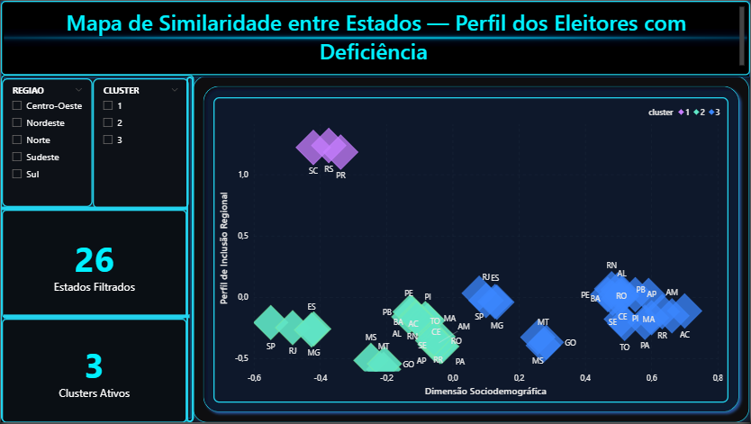
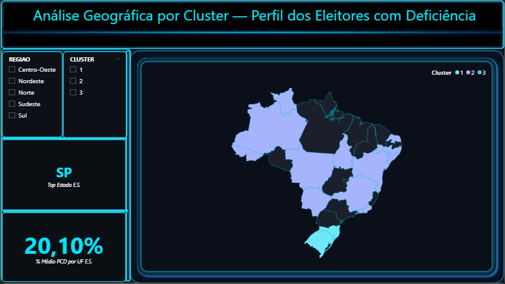

# 🧠✨ Case 1 — ACM + K-Means + Power BI  
## Perfil dos Eleitores com Deficiência — Análise Sociodemográfica e Geográfica

Dashboard futurista com insights digitais extraídos via Python + ACM + K-Means.  
Mapas, clusters e storytelling visual integrado ao Power BI.

---

## 🎯 Objetivo Geral

Este projeto analisa o perfil dos **eleitores com deficiência no Brasil**, combinando:

🔹 **ACM — Análise de Correspondência Múltipla**  
🔹 **Clusterização — K-Means**  
🔹 **Modelagem dimensional — Estrela + Snowflake**  
🔹 **Dashboard interativo — Power BI (tema Futurista Neon)**  

O objetivo é revelar padrões sociodemográficos, similaridades entre os estados e formar agrupamentos inteligentes (clusters) com base em eixos estatísticos da ACM.

---

# 1️⃣ Tecnologias Utilizadas

| Tecnologia | Descrição |
|-----------|------------|
| **Python** | Pré-processamento e modelagem |
| **ACM (MCA)** | Redução dimensional e análise multivariada |
| **K-Means** | Agrupamento automático dos estados |
| **Power BI** | Dashboard profissional interativo |
| **DAX** | Medidas analíticas |
| **Esquema Estrela / Snowflake** | Modelagem dimensional |

---

# 2️⃣ Visualizações do Dashboard

---

### 📌 **Figura 1 — Perfil Analítico do Cluster (Página Perfil)**  

---

### 📌 **Figura 2 — Mapa Perceptual (ACM + K-Means)**  

---

### 📌 **Figura 3 — Mapa do Brasil por Cluster (Análise Geográfica)**  

---

### 📌 **Figura 4 — Modelo Dimensional (Estrela + Snowflake)**  

---

### 📌 **Figura Extra — Página Wiki / Documentação interna**  

---

# 3️⃣ Estrutura das Bases

O projeto utiliza duas tabelas principais:

### ✔️ **estados_metricas_final**
Contém:
- Eixos da ACM  
- Score final de cluster  
- Indicadores derivados  
- Perfil sociodemográfico  
- Métricas utilizadas nos gráficos  

### ✔️ **dataset_powerbi_v3**
Contém:
- Região  
- Informações demográficas  
- Indicadores assistivos  
- Atributos complementares  

---

# 4️⃣ Modelo de Dados — Estrela + Snowflake

**FATO PRINCIPAL — Fato_Estados**
- Métricas transformadas  
- Resultado do K-Means  
- Atributos derivados  

**DIMENSÕES**
- Dim_Estado  
- Dim_Região  
- Dim_Atributos_PCD  

**SNOWFLAKE**
- Dimensões normalizadas para reduzir redundância  
- Otimização de relacionamentos  
- Base mais limpa e eficiente  

---

# 5️⃣ Estrutura do Dashboard

## 📌 Página 1 — Mapa de Similaridade (ACM + K-Means)
- Dispersão 2D com eixos da ACM  
- Agrupamentos por cluster  
- Filtros interativos (Região / Cluster)  
- Cards: Estados filtrados, clusters ativos  

## 📌 Página 2 — Mapa Geográfico por Cluster
- Brasil segmentado por cluster  
- Top Estado automático  
- Métricas agregadas  
- Paleta futurista em neon  

## 📌 Página 3 — Perfil Analítico do Cluster
- Principais KPIs  
- Delta cluster vs Brasil  
- Composição do cluster  
- Gráficos futuristas  
- Painéis analíticos explicativos  

---

# 6️⃣ Principais Medidas (DAX)

- Estados Filtrados  
- Clusters Ativos  
- % Médio PCD por UF  
- Score_Final_Cluster  
- Atributos predominantes  
- Eixos da ACM convertidos em medidas  
- Tooltip dinâmico  

---

# 7️⃣ Design — Tema Futurista Neon

✨ Paleta azul-ciano  
✨ Fundo escuro suave  
✨ Bordas luminosas  
✨ Gráficos com brilho  
✨ Layout geométrico limpo  
✨ Experiência uniforme e profissional  

---

# ✍️ Autoria  
**Cibelly Viegas — 2025**

